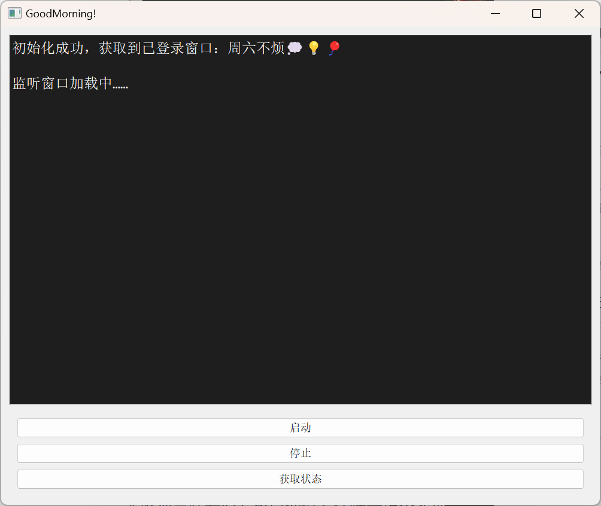
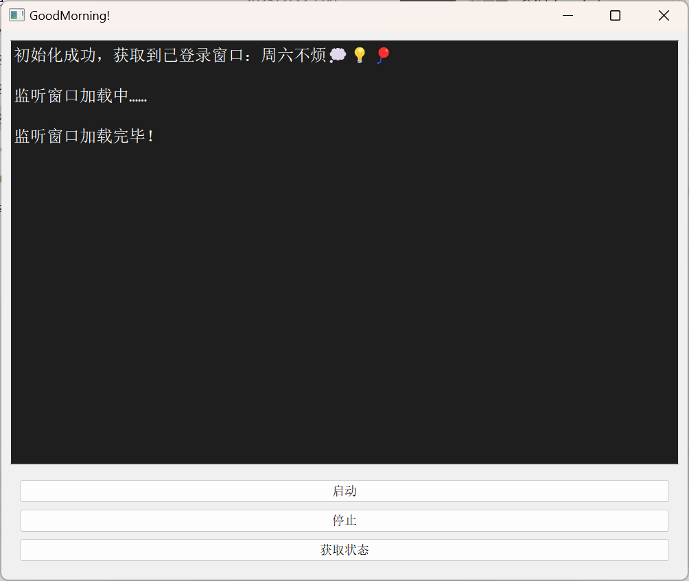

# WeChatAutoReply-ForSpecial

这是作者的写的约等于第一个项目，劳烦各位海涵

本项目基于wxauto的基础版本进行开发，以下是wxauto的链接https://docs.wxauto.org/ 也请大家多多支持！

有不到位的地方还请各位指正！

本项目暂时还有很多不完善的地方，希望可以收到大家的建议和帮助！

## 项目背景介绍：

该项目的开发的原因是作者经常玩电脑导致忘记回复女朋友的信息，所以女朋友希望可以随时呼叫到我并且看到我在干什么。因此作者开发了这个小项目并用来磨练一下自己的代码技术。

## 项目简单介绍：

1.收到特定信息后，可以弹出消息框并进行回复，同时播放音乐进行提醒。

2.收到特定信息后，可以截屏保存发送给对方。

3.对方可以增删和查看指令。

## 使用指南：

在配置好环境的情况下打开app.py文件运行即可，由于exe文件比较大，暂时还不会上传，大家可以对app.py自行打包成exe使用。

当前版本界面如下：

该界面表示正在打开消息框，请耐心等待

但是这一步实测会非常慢，大概3-10分钟，因此最快的方式是启动前提前打开聊天窗口（把这个聊天窗口独立出来）

显示加载完毕即开始监听

对方（被监听的人）发送@help可以查看目前支持的指令

目前支持：

1.@添加呼叫指令：

2.@添加截屏指令：

3.@查看指令集

4.@删除呼叫指令：

5.@删除截屏指令：

calling：呼叫指令，会发送信息“正在加急呼叫中”并播放音乐music.mp3，可以进行替换

watching：截屏指令，会发送信息“图片已保存，马上送达”，并发送图片，图片会及时删除，无需担心

## 注意事项（这个必须看）：

1.需要在登录微信的情况下点击启动，否则会报错。

2.目前仅支持启动操作，不支持其他两个按钮

3.添加想要监视的人需要找到文件core/instruction/listen.txt，在里面输入你想要监视的人的微信名，备注也可以。

4.监视意味着对方可以通过发送特定指令实现相应的功能

